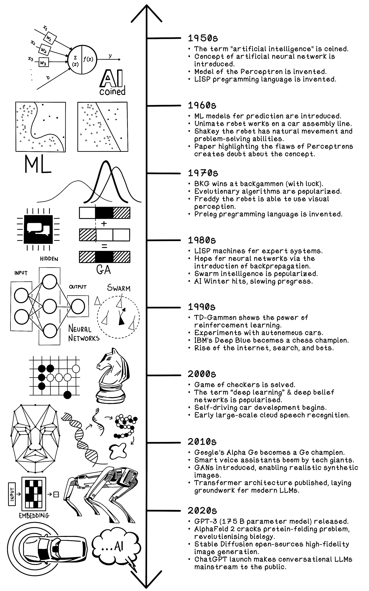

# Grokking Artificial Intelligence Algorithms

[Get Grokking Artificial Intelligence Algorithms at Manning Publications](https://www.manning.com/books/grokking-artificial-intelligence-algorithms?a_aid=gaia&a_bid=6a1b836a) 

Rather Learn by exploring the code notebook in your browser? Click here:

[](https://colab.research.google.com/github/rishal-hurbans/Grokking-Artificial-Intelligence-Algorithms-Notebook/blob/main/Grokking_Artificial_Intelligence_Algorithms_Notebook.ipynb)

## Requirements
* Python 3.7.0+
* Pip 3

## Setup
Make sure that you have Python 3.7.0+ installed. [Download Python here](https://www.python.org/downloads/).
pip3 should be installed with Python 3.7.0+ on macOS and Windows. You may need to install pip3 seperately if you're using Linux.
Use the ```sudo apt-get install python3-pip``` command if you're using Ubuntu or Debian Linux.
Use the ```sudo yum install python3-pip``` command if you're using Fedora Linux. 

Clone this repository.

Navigate to the directory that contains the repository using terminal/console/command line.

Run this command to install the dependency libraries required.

```pip3 install -r requirements.txt```

Navigate to the directory containing the example that you want to run, and run this command.

```python3 <file_name.py>```


## Overview
This is the official supporting code for the book, Grokking Artificial Intelligence Algorithms, published by Manning Publications, authored by Rishal Hurbans.



The example implementations provided will make more sense if you've read the book, however, it might be somewhat useful to you otherwise.

The purpose of this repository is to act as a practical reference for examples of how the algorithms mentioned in the book can be implemented.
This repository should not be consulted as the book is read page-by-page, but rather, when you're attempting to implement an algorithm or gain a more technical understanding from a programming perspective.


