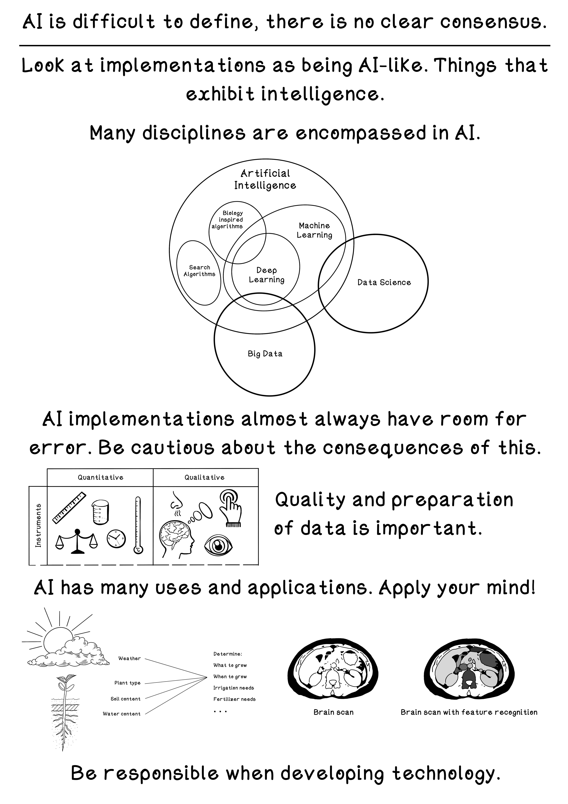

# Chapter 1 - Intuition of Artificial Intelligence
Intelligence is a mystery. Intelligence is a concept that has no agreed upon definition. Philosophers, psychologists, scientists and engineers all have different opinions about what it is and how it emerges. We see intelligence in nature around us such as groups of living creatures working together, and we see intelligence in the way that we think and behave. In general, things that are autonomous yet adaptive are considered to be intelligent.

This directory does not contain any code since there are no specific algorithm implementations discussed in Chapter 1.

## Summary
