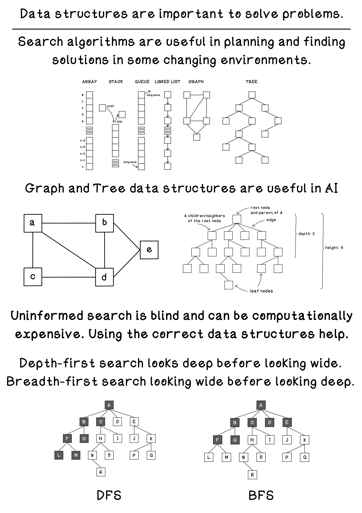

# Chapter 2 - Search Fundamentals
## Uninformed Search
Uninformed search is also known as unguided search, blind search, or brute-force search. Uninformed search algorithms have no additional information about the domain of the problem apart from the representation of the problem which is usually a tree.

Think about when you explore things you want to learn. Some might look at a wide breadth of different topics and learn the basics of each, whereas others might choose one narrow topic and explore its subtopics in depth. This is what Breadth-first Search and Depth-first Search involves, respectively. Depth-first search explores a specific path from the start till it finds a goal at the utmost depth. Breadth-first search explores all options at a specific depth before moving to options deeper in the tree.

## Summary

## What's Included
- Breadth-first Search (BFS) and Depth-first Search (DFS) on a simple maze.
- Problem representation and state expansion basics.

## Key Scripts
- `uninformed_search/maze_bfs.py`: BFS over a grid maze.
- `uninformed_search/maze_dfs.py`: DFS over a grid maze.
- `uninformed_search/maze_puzzle.py`: Maze definition and utilities.

## How To Run
- From this folder:
  - `python3 uninformed_search/maze_bfs.py`
  - `python3 uninformed_search/maze_dfs.py`

## Notes
- Compare traversal order and path length differences between BFS and DFS.
