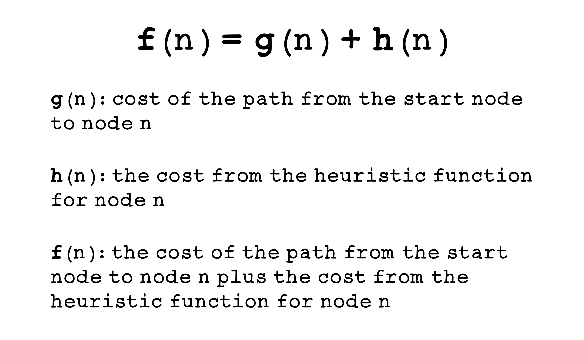
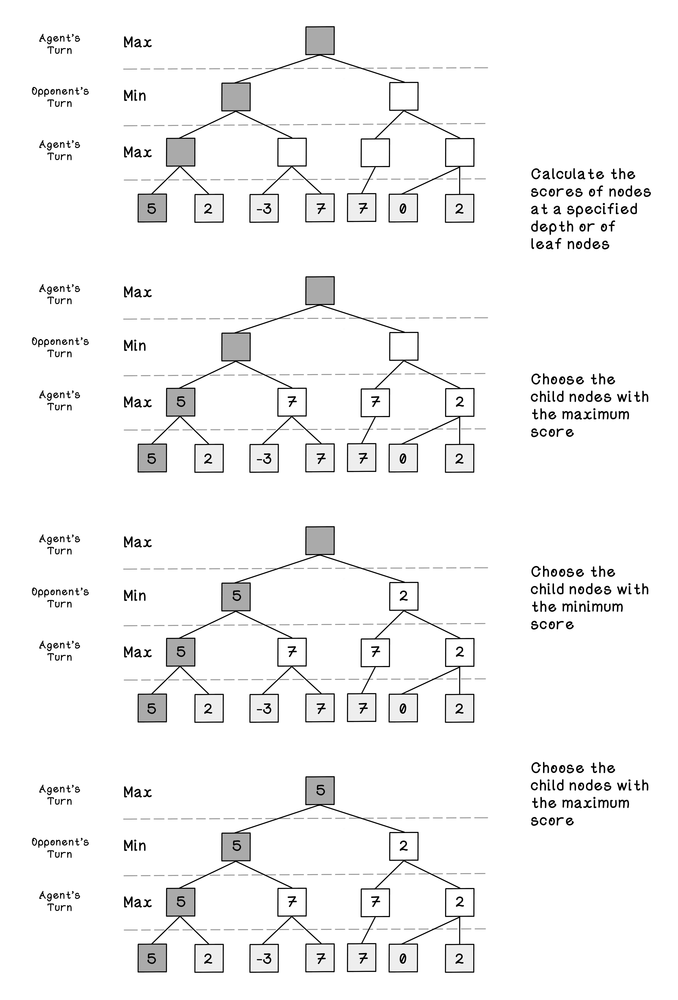
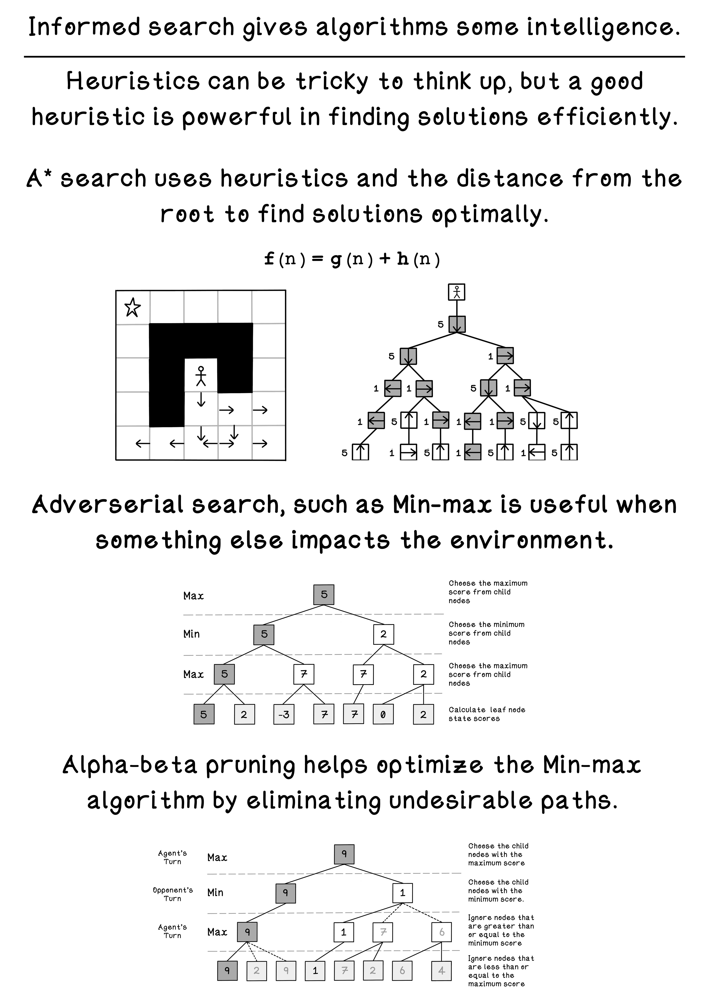

# Chapter 3 - Intelligent Search
## Informed Search
Informed search, also known as heuristic search, is an algorithm that uses both breadth-first search and depth-first search approaches combined with some “intelligence” where the search is guided by heuristics given some predefined knowledge about the problem at hand. 

A* search is pronounced as “A star search”. The A* algorithm usually improves performance by estimating heuristics to minimize cost of the next node visited. 

Total cost is calculated using two metrics: the total distance from the start node to the current node, and the estimated cost of moving to a specific node by utilizing a heuristic. When attempting to minimize cost, a lower value will indicate a better performing solution.

## Adverserial Search
Adversarial problems require one to anticipate, understand, and counteract the actions of the opponent in pursuit of a goal. Some examples of adversarial problems include two-player turn-based games like chess, tick-tack-toe, and connect four.

Min-max search aims to build a tree of possible outcomes based on moves that each player could make and favor paths that are advantageous to the agent, whilst avoiding paths that are favorable for the opponent. It does this by simulating possible moves and scoring the state based on a heuristic after making the respective move. Min-max attempts to discover as many states in the future as possible, however, due to memory and computation limitations, discovering the entire game tree may not be realistic, so it will search until a specified depth. 

## Summary
 
