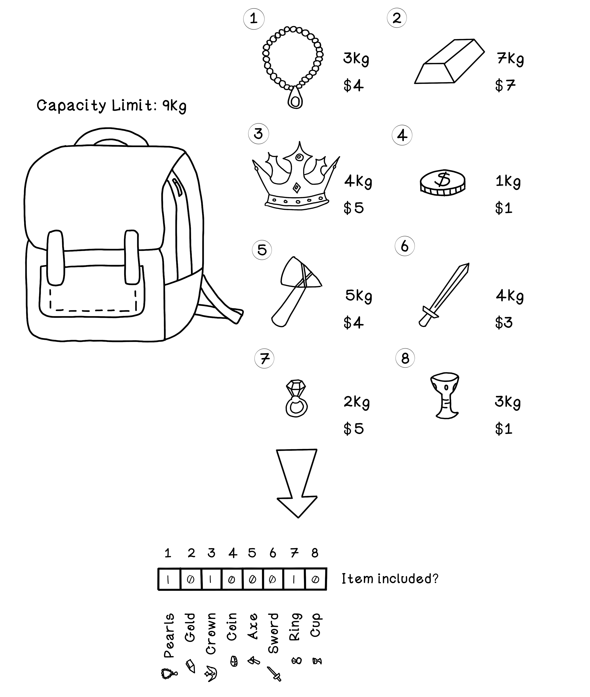
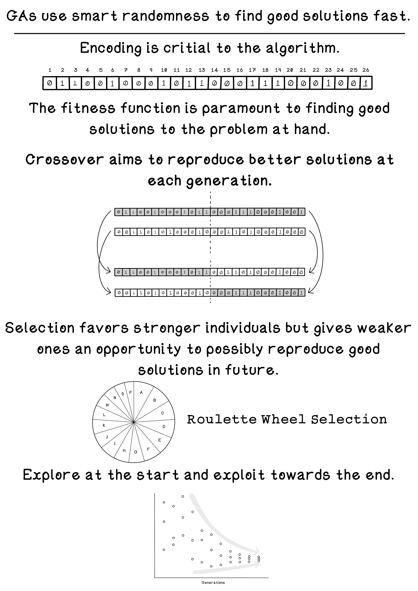

# Chapter 4 - Evolutionary Algorithms
The theory of evolution suggests that organisms evolve through reproduction by producing children of mixed genes from their parents; and given the fitness of these individuals in their environment, stronger individuals have a higher likelihood of survival.

## Genetic Algorithm
The example used is the Knapsack Problem. The Knapsack Problem has number of items that can be placed into the bag. A simple way to describe a possible solution that contains some items but not others is binary encoding. Binary encoding would represent excluded items with 0s and included items with 1s. If for example at gene index 3, the value is 1, that item is marked to be included. The complete binary string would always be the same size – this is the total number of items available for selection. 

## Summary
