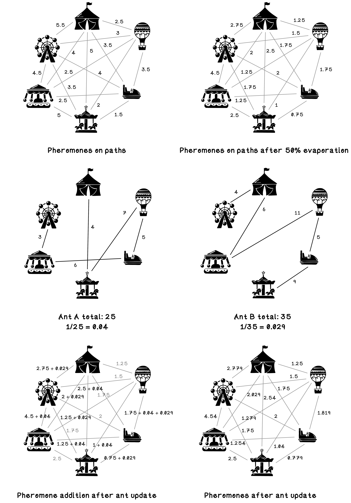

# Chapter 6 - Swarm Intelligence - Ants
Similarly to the theory of evolution, the observation of the behavior of lifeforms in nature is the inspiration for the concepts behind swarm intelligence. When we observe the world around us, we see many different lifeforms that are seemingly primitive and unintelligent as individuals yet exhibit intelligent emergent behavior when acting in groups.

The Ant Colony Optimization algorithm is inspired by the behavior of ants moving between destinations, dropping pheromones and acting on pheromones that they come across. The emergent behavior is ants converging to paths of least resistance.  

## Summary

## What's Included
- Ant Colony Optimization (ACO) on a set of attractions with distances.
- Pheromone trails, evaporation, and probabilistic path construction.

## Key Scripts
- `carnival_brute_force.py`: Exhaustive tour construction for small instances.
- `carnival_aco.py`: ACO solver with pheromone updates and evaporation.
- CSV data: `attractions-*.csv` distance matrices.

## How To Run
- From this folder:
  - `python3 carnival_brute_force.py`
  - `python3 carnival_aco.py`

## Notes
- Tweak parameters (alpha, beta, evaporation rate, ant count) to see convergence on different datasets.
