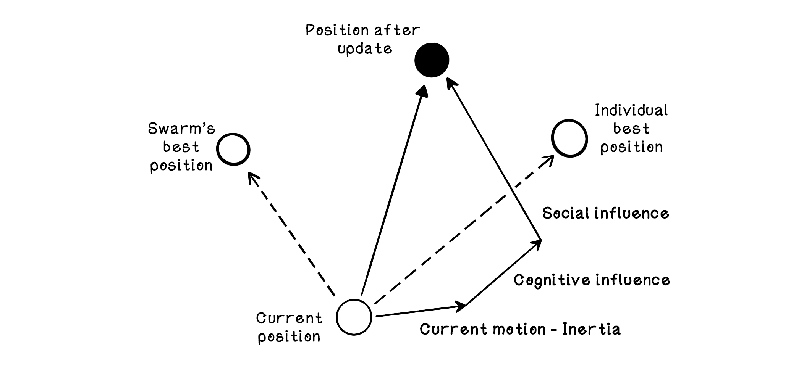
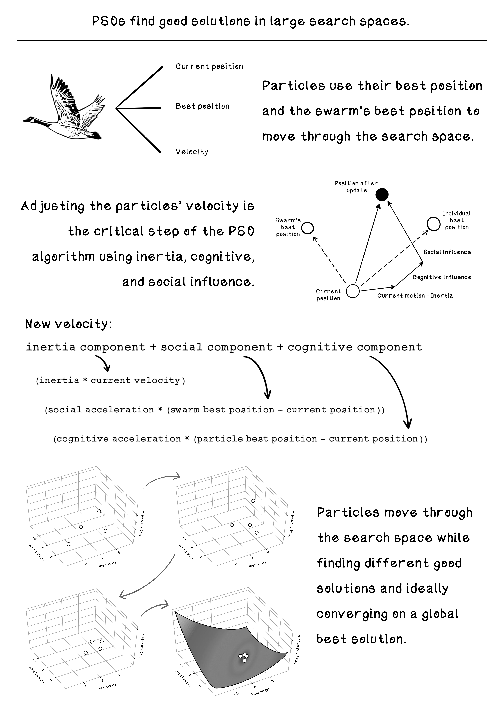

# Chapter 7 - Swarm Intelligence - Particles
Particle swarm optimization involves a group of individuals at different points in the solution space, all using real-life swarm concepts to find an optimal solution in the space. Imagine a swarm of bees that spread out looking for flowers and gradually converging on an area that has the most density of flowers. As more bees find the flowers, more are attracted to it. At its core, this is what particle swarm optimization entails. Particles make velocity adjustments based on an inertia component, cognitive component, and social component. 

## Summary

