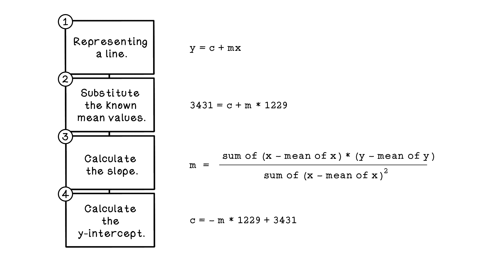
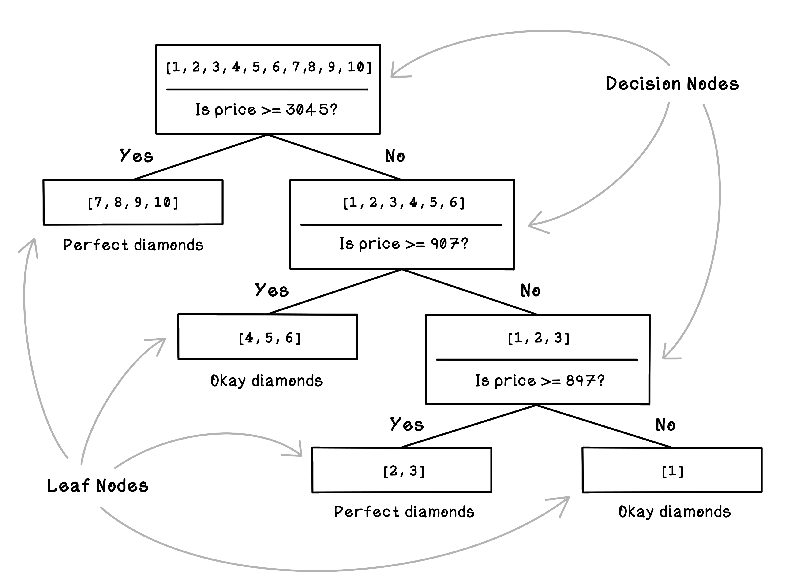
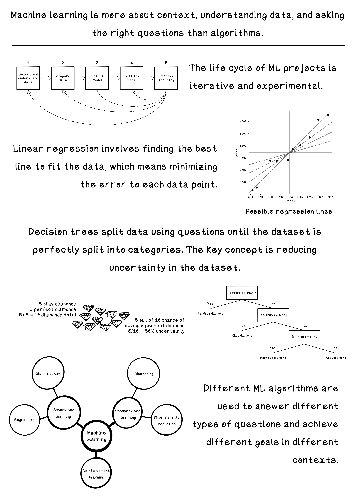

# Chapter 8 - Machine Learning
Machine learning is only useful if you have data and have questions to ask that the data might answer. Machine learning algorithms find patterns in data but cannot magically do useful things unless you design it to. 

One of the most common techniques in traditional machine learning is supervised learning. We want to look at data, understand the patterns and relationships between the data, and be able to predict what results might be given new examples. The earlier apartment finding problem is an example of supervised learning where we used examples to learn the pattern. You will also see this in action when you type a Google search and it autocompletes, or when music applications suggest new songs for you to listen to based on your activity and preference.

## Liner Regression
Linear regression is one of the simplest machine learning algorithms that finds relationships between two variables and allows us to predict one variable given the other. An example of this is predicting the price of a diamond based on its caret value. By looking at many examples of known diamonds including their price and caret values, we can teach a model the relationship and ask it to estimate predictions.
 

## Decision Trees
Decision trees are structures that describe a series of decisions that are made to find a solution to a problem. If we’re deciding whether or not to wear shorts for the day, we might make a series of decisions to inform the outcome. Will it be cold during the day? If not, will we be out late in the evening when it does get cold? We might decide to wear shorts on a warm day, but not if we will be out when it gets cold.

## Summary

