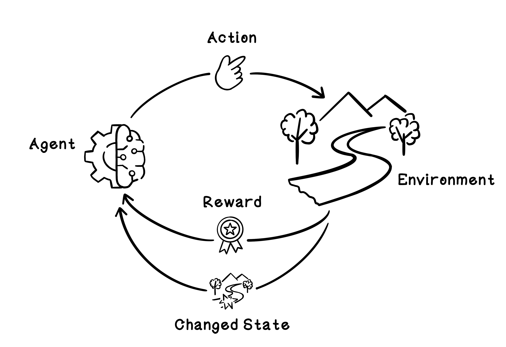
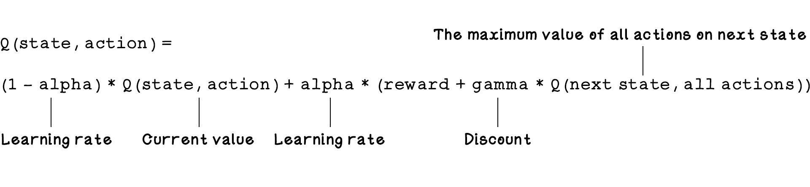
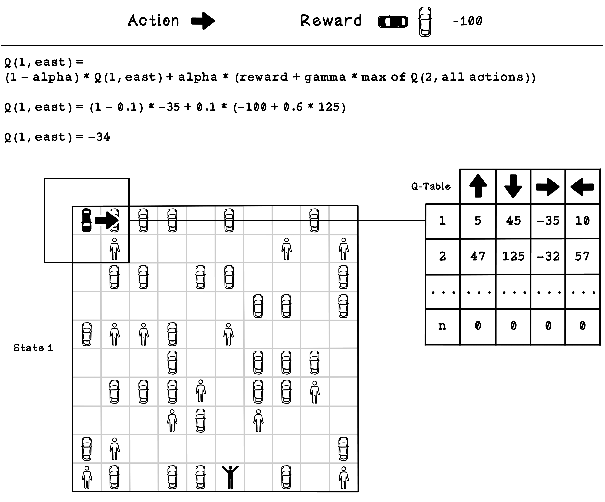
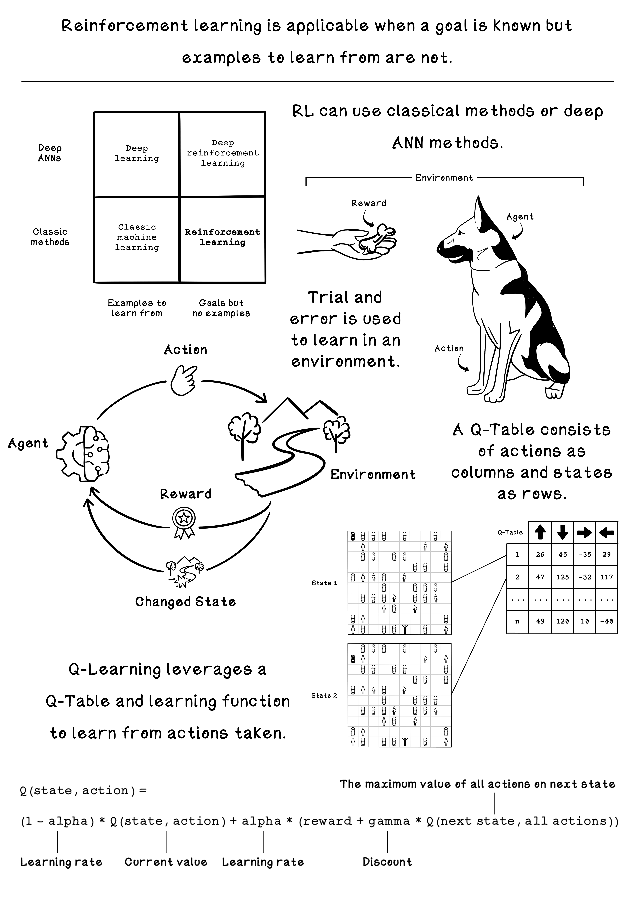

# Chapter 10 - Reinforcement Learning with Q-Learning
Q-learning is an approach in reinforcement learning that uses the different states and actions in an environment to model a table that contains information describing favorable actions based on specific states. Think of it as a dictionary where the key is the state of the environment, and the value is the best action to take for that state. 

In RL with Q-learning, there is a concept of a reward table – it’s called a Q-table. This table consists of columns that represent the possible actions, and rows that represent the possible states in the environment. The point of the Q-table is to describe which actions are more favorable for the agent as it seeks a goal. These values that represent favorable actions are learned through simulating the possible actions in the environment and learning from the outcome and change in state. 

## Summary

