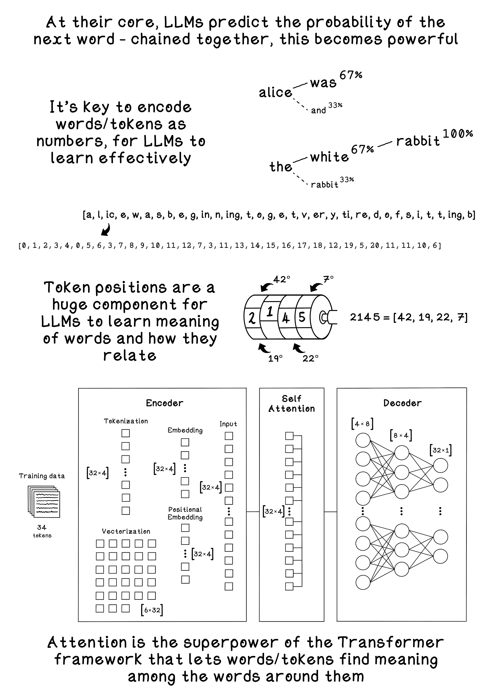

# Chapter 11 - Large Language Models (LLMs)

Large Language Models learn to predict the next token in a sequence. By repeatedly predicting one token at a time, they can generate text that resembles the patterns in their training data. Two key ingredients make this work:

- Tokenization and vocabulary: The raw text is split into tokens (often characters or subwords). A vocabulary assigns each token an ID so models can operate on discrete inputs.
- Next‑token prediction: Given a context of previous tokens, the model estimates a probability distribution over the next token. Training minimizes the surprise (cross‑entropy) of the true next token.

In practice, modern LLMs use attention to condition on long contexts and subword tokenizers (like BPE or WordPiece) for efficient vocabularies. This chapter keeps things intuitive and small so you can see the mechanics end‑to‑end.

What’s included
- Tokenization and merging: A minimal pipeline that turns raw text into tokens, builds a vocabulary, and packs the token stream into fixed‑size blocks.
- Toy language model: A pure‑Python bigram model that estimates P(next | current) with Laplace smoothing, reports validation perplexity, and performs simple sampling (no external ML libraries).
- Data: Example plaintext files (e.g., Alice in Wonderland) and a `temp/` folder with prepared sample corpora.

Key script
- `toy_llm_transformer.py` — end‑to‑end demo that:
  - tokenizes text into character tokens
  - performs simple frequency‑based merges (BPE‑like intuition)
  - maps tokens → IDs and packs blocks
  - builds/evaluates a tiny bigram model (no frameworks)
  - generates samples and offers an optional interactive loop

How to run
- From this folder, run: `python3 toy_llm_transformer.py`
- Optional: place your own `.txt` file alongside the script to experiment with different corpora.

Notes
- The bigram model is educational and intentionally simple. It shows the core ideas (tokenization, counts, probability, sampling) without any framework.
- The `temp/` folder contains auxiliary demo files used during development and experimentation.
