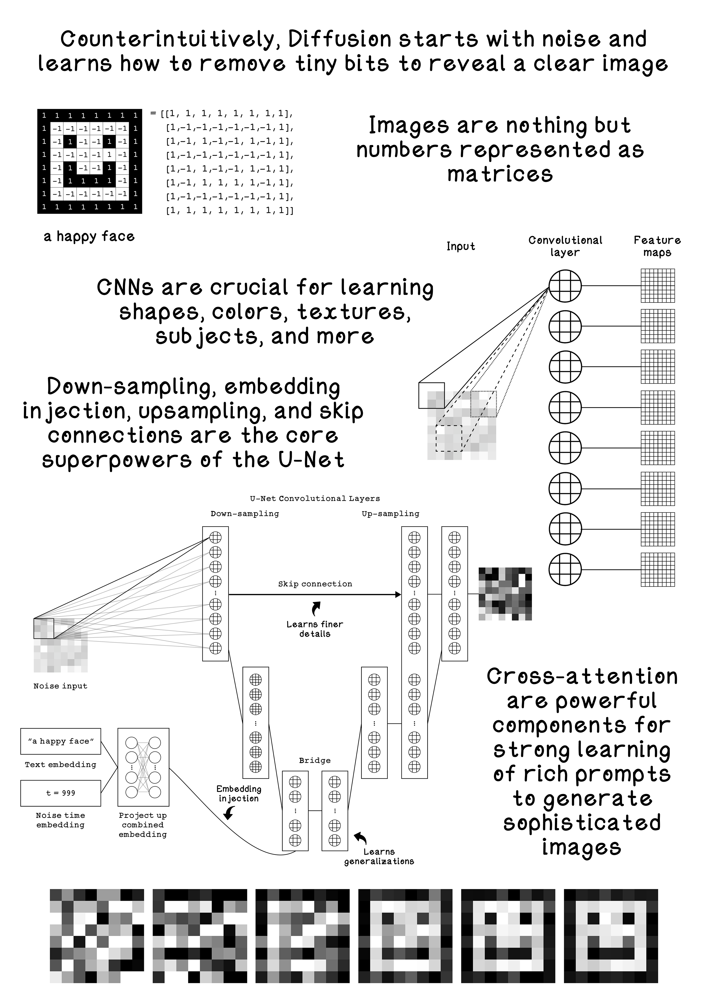

# Chapter 12 - Generative Image Models

Generative diffusion models create images by learning to reverse a gradual noising process. Training teaches a model to predict and remove noise added to images at various timesteps; sampling then starts from noise and iteratively denoises toward a coherent image. A U‑Net provides the backbone, combining multi‑scale features via skip connections to denoise effectively.

Key concepts
- Forward diffusion: Add small amounts of noise to an image over many steps, eventually destroying structure.
- Reverse diffusion: Learn to predict the noise at each step so it can be subtracted, recovering structure.
- U‑Net: An encoder–decoder with skip connections that preserves fine detail while reasoning at multiple scales.

What’s included
- NumPy U‑Net (from scratch): Convolution, transposed convolution, normalization, and non‑linearities composed into a tiny U‑Net; includes a training loop and simple visualization.
- PyTorch U‑Net (concise reference): Mirrors the same architecture with PyTorch modules for quicker iteration and readability.
- Toy data: Small 8×8 “emoji‑like” matrices for fast training and easy inspection of the diffusion and denoising process.

Key scripts
- `numpy_u_net/toy_numpy_u_net_train.py`: From‑scratch U‑Net layers and training (NumPy only).
- `numpy_u_net/toy_numpy_u_net_generate.py`: Loads the trained NumPy weights and visualizes generation steps.
- `pytorch-u_net/toy_pytorch_u_net_train.py`: Compact U‑Net in PyTorch, training on toy data.
- `pytorch-u_net/toy_pytorch_u_net_generate.py`: Loads weights and performs inference/visualization.

How to run
- NumPy version:
  - `python3 numpy_u_net/toy_numpy_u_net_train.py`
  - `python3 numpy_u_net/toy_numpy_u_net_generate.py`
- PyTorch version (if you have PyTorch installed):
  - `python3 pytorch-u_net/toy_pytorch_u_net_train.py`
  - `python3 pytorch-u_net/toy_pytorch_u_net_generate.py`

Notes
- The examples are intentionally tiny to keep training fast and the code approachable.
- If you only want zero‑dependency examples, use the NumPy version; the PyTorch scripts are optional.
